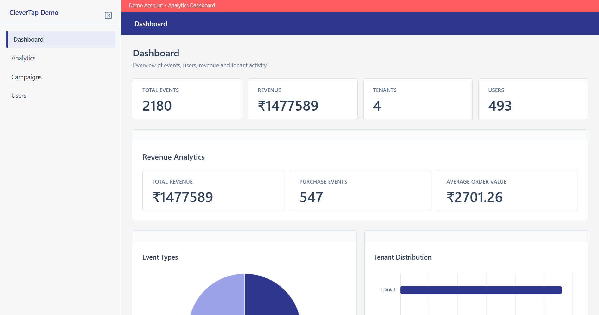
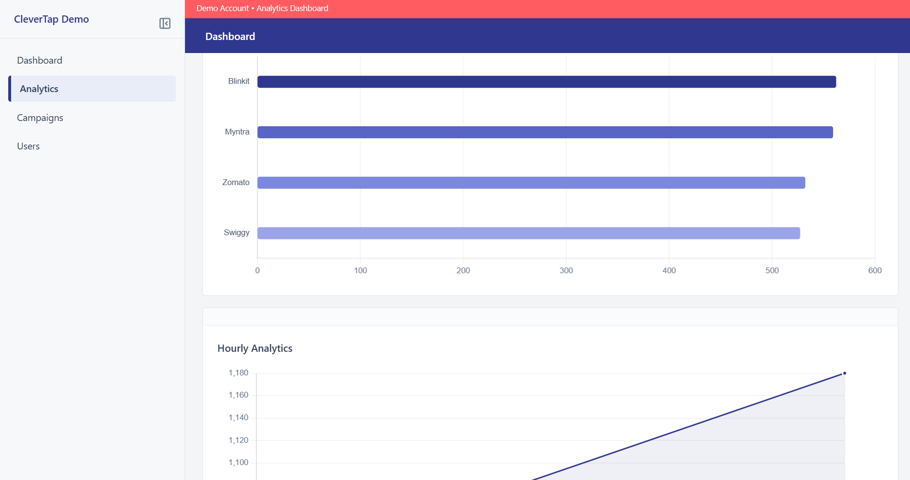
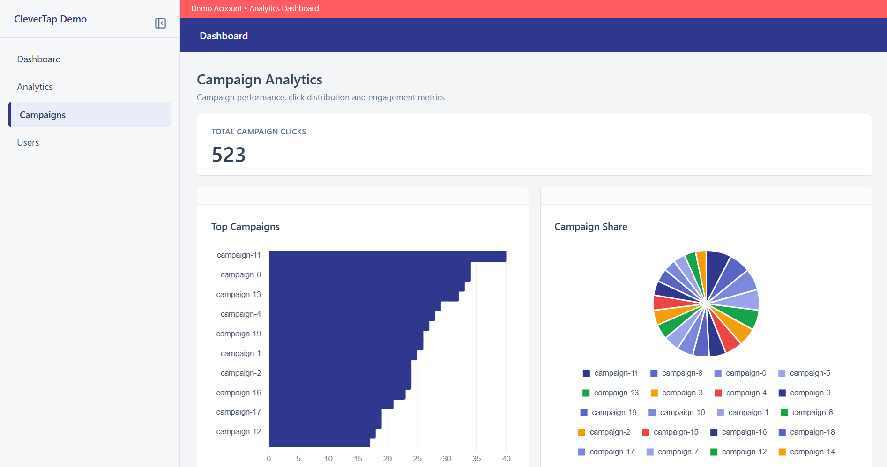
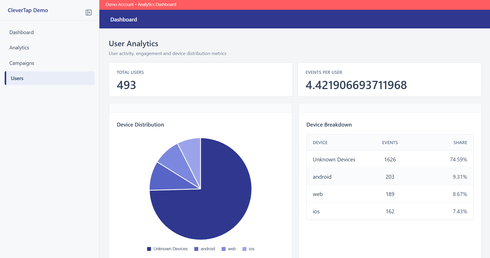

# Analytics Dashboard

Vue-based analytics dashboard for a ClickHouse-powered event analytics platform inspired by CleverTap.

This repository provides the visualization layer of the system, transforming analytical APIs into interactive dashboards, charts, and user insights.

---

## System Architecture

```text
┌──────────────────────────────┐
│      Event Ingestion         │
│      Java Event Pipeline     │
└──────────────┬───────────────┘
               │
               ▼
┌──────────────────────────────┐
│         ClickHouse           │
│   Events + Materialized      │
│           Views              │
└──────────────┬───────────────┘
               │
               ▼
┌──────────────────────────────┐
│       Analytics API          │
│        Spring Boot           │
└──────────────┬───────────────┘
               │
               ▼
┌──────────────────────────────┐
│     Analytics Dashboard      │
│      (This Repository)       │
└──────────────────────────────┘
```

### Related Repositories

- [Event Ingestion](https://github.com/username/data-collection-pipeline)
- [Analytics API](https://github.com/username/analytics-api)

---

## Dashboard






---

## Features

- Dashboard overview metrics
- Event analytics
- Revenue analytics
- Campaign analytics
- User analytics
- Tenant analytics
- Device analytics
- Hourly event trends
- Partition distribution analysis
- Interactive charts
- Responsive dashboard layout
- Sidebar navigation

---

## Dashboard Modules

### Dashboard

- Total events
- Total users
- Total tenants
- Revenue overview

### Analytics

- Event type distribution
- Tenant distribution
- Revenue insights
- Hourly activity trends
- Partition analysis

### Campaigns

- Campaign performance
- Campaign share analysis
- Click distribution

### Users

- User activity metrics
- Device distribution
- Average events per user
- User engagement analytics

---

## Frontend Architecture

```text
Pages
   │
   ▼
Components
   │
   ▼
API Layer
   │
   ▼
Spring Boot APIs
```

The application follows a component-driven architecture using reusable cards, charts, and API services.

---

## Technology Stack

- Vue 3
- TypeScript
- Tailwind CSS
- Vue Router
- Axios
- Chart.js
- Vite
- pnpm

---

## Project Structure

```text
src/
├── api/
├── components/
│   ├── cards/
│   └── charts/
├── layouts/
├── pages/
├── router/
├── types/
└── assets/
```

---

## Quick Start

```bash
git clone https://github.com/username/analytics-dashboard

cd analytics-dashboard

pnpm install

pnpm dev
```

The dashboard starts on:

```text
http://localhost:5173
```

---

## Backend Configuration

The dashboard communicates exclusively with the Analytics API.

```text
Frontend
    │
    ▼
Spring Boot API
    │
    ▼
ClickHouse
```

The frontend never communicates directly with ClickHouse.

---

This repository serves as the visualization layer of the analytics platform, transforming analytical data into actionable insights through interactive dashboards and charts.
